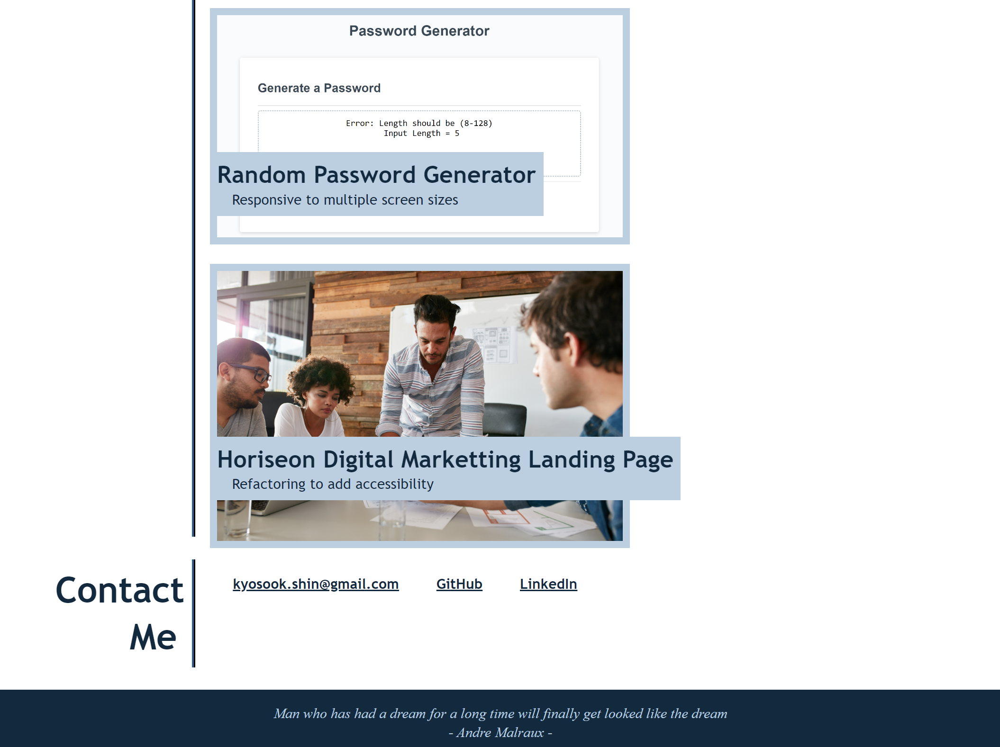

# KyoSook_Shin_portfolio
 
## Description

This site provides portfolio of KyoSook Shin's work samples.

## Features

* WHEN you load the portfolio, THEN you am presented with KyoSook Shin's name, a recent photo or avatar, and links to sections about my works, and how to contact me

* WHEN you click one of the links in the navigation, THEN the UI scrolls to the corresponding section

* WHEN you click on the link to the section about their work, THEN the UI scrolls to a section with titled images of the applications

* WHEN you click on the images of the applications, THEN you am taken to that deployed application

* WHEN you resize the page or view the site on various screens and devices, THEN you are presented with a responsive layout that adapts to your viewport

## Contact
  * Author: Kyosook Shin
  * Author's Email: kyosook.shin@gmail.com
  * Deployed URL: https://alla0810.github.io/KyoSook_Shin_portfolio/
  * GitHub: https://github.com/alla0810/KyoSook_Shin_portfolio

## Screenshots

  
  

## Source Code References
  This project has used some reference codes from the following sites

    * https://git.bootcampcontent.com/University-of-Texas-at-Austin/UTA-VIRT-FSF-PT-07-2023-U-LOLC/-/tree/main/02-Advanced-CSS/01-Activities

